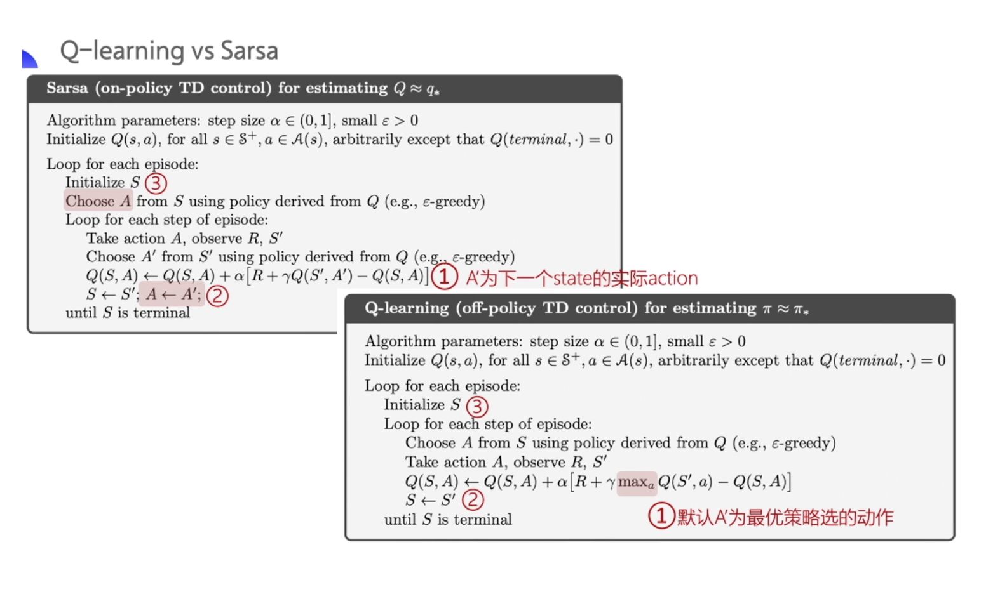

# QLearning

## 使用说明

运行```task0.py```或```task1.py```即可

## 环境说明

```task0.py```使用openai gym中的[Cliff Walking](https://www.gymlibrary.ml/environments/toy_text/cliff_walking/)

```task1.py```使用openai gym中的[Frozen Lake](https://www.gymlibrary.ml/environments/toy_text/frozen_lake/)

## 算法伪代码



## 其他说明

事实上，Q-learning 算法被提出的时间更早，Sarsa 算法是 Q-learning 算法的改进。


**Sarsa 和 Q-learning 的更新公式都是一样的，区别只在 target 计算的这一部分，**

* Sarsa 是 $R_{t+1}+\gamma Q(S_{t+1}, A_{t+1})$  ；
* Q-learning 是 $R_{t+1}+\gamma  \underset{a}{\max} Q\left(S_{t+1}, a\right)$ 。

Sarsa 是用自己的策略产生了 S,A,R,S',A' 这一条轨迹。然后拿着 $Q(S_{t+1},A_{t+1})$ 去更新原本的 Q 值 $Q(S_t,A_t)$。 

但是 Q-learning 并不需要知道我实际上选择哪一个 action ，它默认下一个动作就是 Q 最大的那个动作。Q-learning 知道实际上 behavior policy 可能会有 10% 的概率去选择别的动作，但 Q-learning 并不担心受到探索的影响，它默认了就按照最优的策略来去优化目标策略，所以它可以更大胆地去寻找最优的路径，它会表现得比 Sarsa 大胆非常多。

对 Q-learning 进行逐步地拆解的话，跟 Sarsa 唯一一点不一样就是并不需要提前知道 $A_2$ ，我就能更新 $Q(S_1,A_1)$ 。在训练一个 episode 这个流程图当中，Q-learning 在 learn 之前它也不需要去拿到 next action $A'$，它只需要前面四个 $ (S,A,R,S')$ ，这跟 Sarsa 很不一样。 
## On-policy vs. Off-policy

**总结一下 on-policy 和 off-policy 的区别。**

* Sarsa 是一个典型的 on-policy 策略，它只用了一个 policy $\pi$，它不仅使用策略 $\pi$ 学习，还使用策略 $\pi$ 与环境交互产生经验。如果 policy 采用 $\varepsilon$-greedy 算法的话，它需要兼顾探索，为了兼顾探索和利用，它训练的时候会显得有点胆小。它在解决悬崖问题的时候，会尽可能地离悬崖边上远远的，确保说哪怕自己不小心探索了一点，也还是在安全区域内。此外，因为采用的是 $\varepsilon$-greedy 算法，策略会不断改变($\varepsilon$ 会不断变小)，所以策略不稳定。
* Q-learning 是一个典型的 off-policy 的策略，它有两种策略：target policy 和 behavior policy。它分离了目标策略跟行为策略。Q-learning 就可以大胆地用 behavior policy 去探索得到的经验轨迹来去优化目标策略，从而更有可能去探索到最优的策略。Behavior policy 可以采用 $\varepsilon$-greedy 算法，但 target policy 采用的是 greedy 算法，直接根据 behavior policy 采集到的数据来采用最优策略，所以 Q-learning 不需要兼顾探索。
* 比较 Q-learning 和 Sarsa 的更新公式可以发现，Sarsa 并没有选取最大值的 max 操作，因此，
  * Q-learning 是一个非常激进的算法，希望每一步都获得最大的利益；
  * 而 Sarsa 则相对非常保守，会选择一条相对安全的迭代路线。

## 参考资料：
1.[EasyRL](https://datawhalechina.github.io/easy-rl/#/chapter3/chapter3?id=sarsa-on-policy-td-control)
