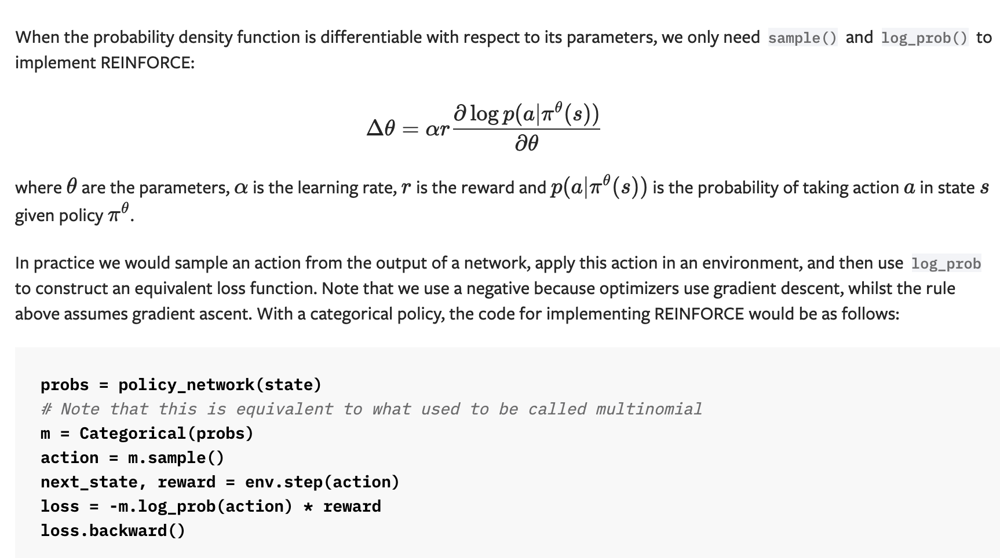
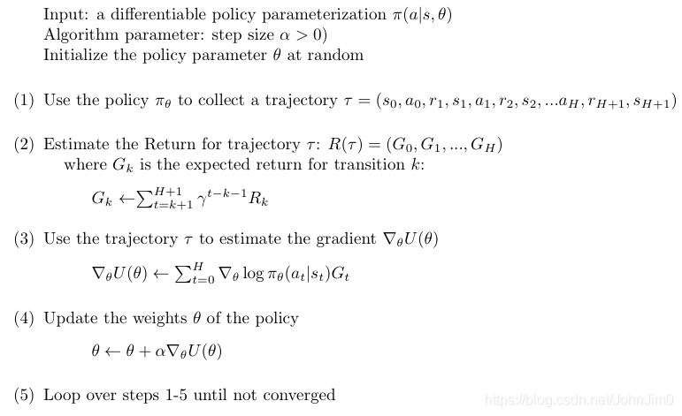

# Policy Gradient


Policy-based方法是强化学习中与Value-based(比如Q-learning)相对的方法，其目的是对策略本身进行梯度下降，相关基础知识参考[Datawhale-Policy Gradient](https://datawhalechina.github.io/leedeeprl-notes/#/chapter4/chapter4)。
其中REINFORCE是一个最基本的Policy Gradient方法，主要解决策略梯度无法直接计算的问题，具体原理参考[CSDN-REINFORCE和Reparameterization Trick](https://blog.csdn.net/JohnJim0/article/details/110230703)

## 使用说明

运行```task.py```文件即可，运行结果存储在```outputs```文件夹中

## 环境说明

```task0.py```使用openai gym中的[Cart Pole](https://www.gymlibrary.ml/environments/classic_control/cart_pole/)

```task1.py```使用openai gym中的[Mountain Car](https://www.gymlibrary.ml/environments/classic_control/mountain_car/)

```task2.py```使用openai gym中的[Acrobot](https://www.gymlibrary.ml/environments/classic_control/acrobot/)

## 伪代码

结合REINFORCE原理，其伪代码如下：



https://pytorch.org/docs/stable/distributions.html

加负号的原因是，在公式中应该是实现的梯度上升算法，而loss一般使用随机梯度下降的，所以加个负号保持一致性。



## 参考

[EasyRL](https://datawhalechina.github.io/easy-rl/#/chapter3/chapter3?id=sarsa-on-policy-td-control)

[REINFORCE和Reparameterization Trick](https://blog.csdn.net/JohnJim0/article/details/110230703)

[Policy Gradient paper](https://papers.nips.cc/paper/1713-policy-gradient-methods-for-reinforcement-learning-with-function-approximation.pdf)

[REINFORCE](https://towardsdatascience.com/policy-gradient-methods-104c783251e0)
